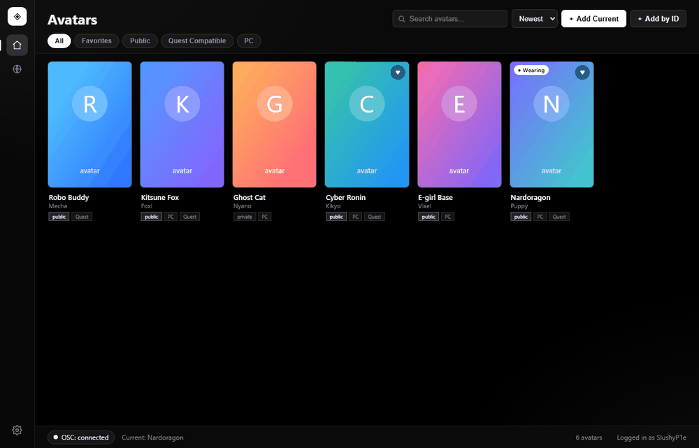
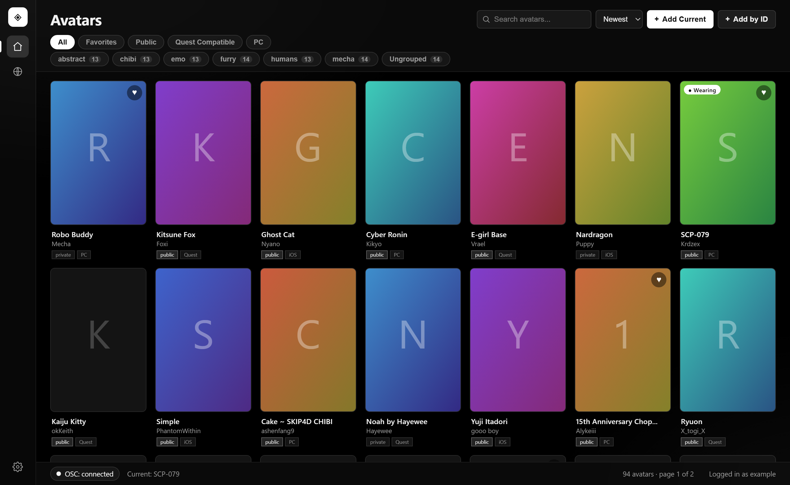
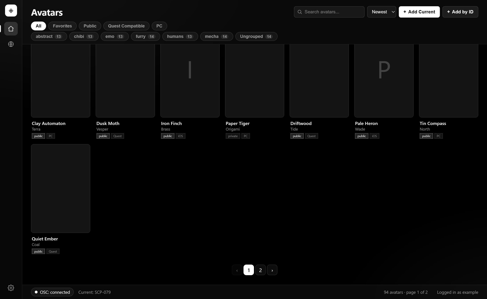
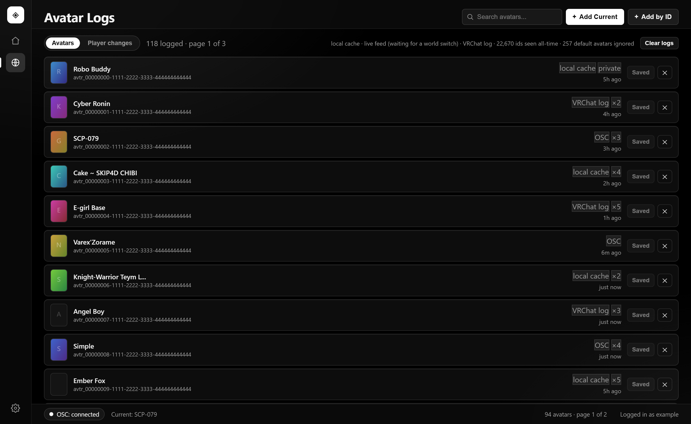
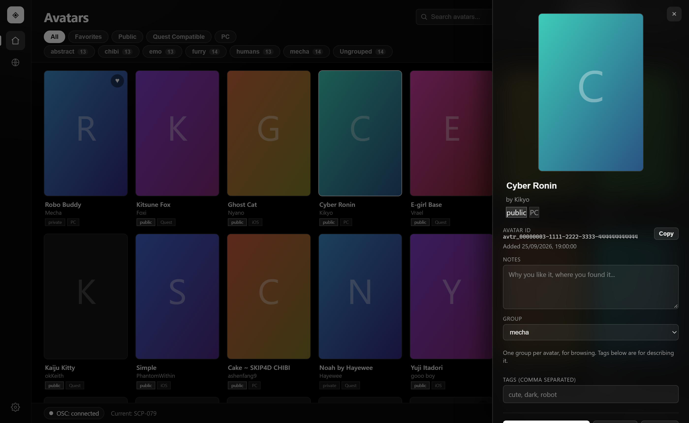
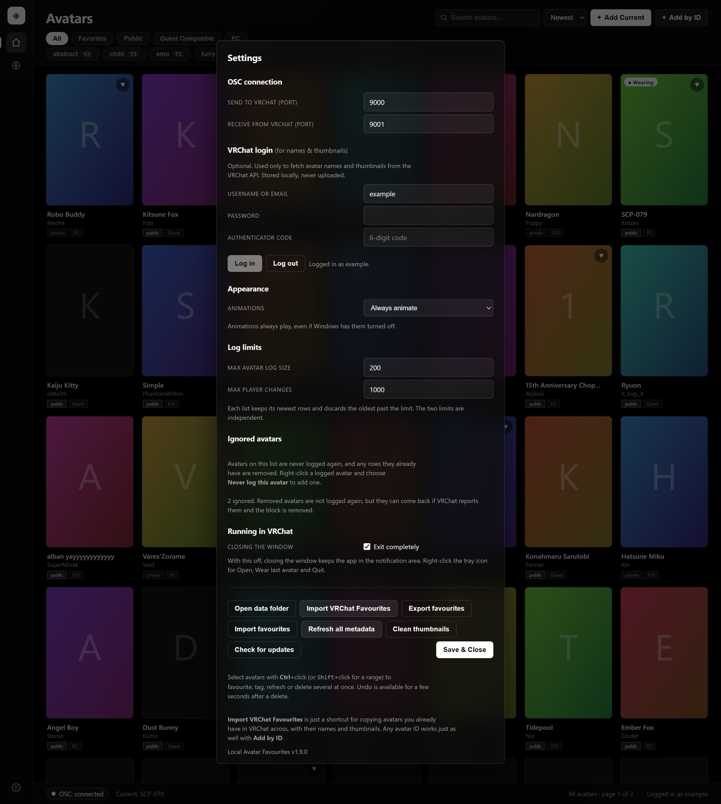

# Local Avatar Favourites

A small standalone Windows tool for VRChat that keeps an **unlimited local list of favourite avatars** (with notes, tags, search, and thumbnails) and lets you **switch to them with one click** while in-game, this is the main use. Avatar Log is second to this so do not expect perfection.

   



---

## Screenshots

| Favourites grid | Page buttons |
| --- | --- |
|  |  |

| Avatar logs | Avatar details |
| --- | --- |
|  |  |

| Settings | |
| --- | --- |
|  | |

The images are generated, not hand-taken. `docs/render_screenshots.py` and
`docs/render_preview.py` load the shipped `index.html`, `style.css` and `app.js`
in headless Chrome against invented fixture data, so the screenshots cannot drift
from the interface and no real avatar artwork or personal collection is
published. Run them after a UI change:

```
python docs/render_screenshots.py
python docs/render_preview.py
```

---

## Download

Prebuilt Windows executables are published on the
[Releases page](https://github.com/SlushyP1e/Local-Avatar-Favourites/releases/latest).
Grab the latest `LocalAvatarFavourites.exe` and run it — no Python install needed.

---

## Quick start

1. **Launch VRChat** and get into any world.
2. Open the **Action Menu** → **OSC** → **Enabled**. (Toggle it on.)
3. Run `LocalAvatarFavourites.exe`.
4. Switch your avatar once in-game so VRChat tells the tool what you're wearing.
5. Click **+ Add Current** to save it. Click **+ Add by ID** to paste an avatar ID.
6. **Double-click** an avatar in the list (or press **Wear Avatar**) to wear it.

Your favourites are saved locally in:

```
%APPDATA%\LocalAvatarFavourites\favourites.json
```

Thumbnails are cached in `%APPDATA%\LocalAvatarFavourites\thumbs\`.

---

## Important: how avatar switching works

The tool talks to VRChat over **OSC** using the `/avatar/change` message.

- To know what you're wearing, VRChat **broadcasts** the current avatar ID whenever an avatar loads.
- To **wear** an avatar, the tool sends that avatar ID back to VRChat.

**Anything can be added to this list.** An avatar ID does not have to be in your
VRChat Favourites, and you do not have to own it — **Wear Avatar** is the only
step.

VRChat does refuse a small number of avatars, namely the ones your account
cannot use: private avatars, and paid avatars you have not bought. It refuses
them *silently* — no error comes back, the avatar just never loads. So the tool
watches for VRChat to broadcast the new ID after a switch, and if nothing arrives
within a few seconds it says the change was probably refused, and why.

---

## How avatar discovery works

VRChat does not tell third-party tools which avatar another player is wearing.
There is no API for it, and the log file does not contain it — a 2.5 MB session
log yielded 11 avatar IDs, nearly all of them your own.

VRChat *does* write real `avtr_` IDs to your PC, though, in the files it uses to
cache avatars. This tool reads them, in priority order:

| Source | Path | What it gives |
| --- | --- | --- |
| Local cache database | `%LOCALAPPDATA%..\LocalLow\VRChat\VRChat\avatars.sqlite` | Every avatar seen in the past |
| Live feed | `%TEMP%\VRChat\VRChat\amplitude.cache` | Avatars seen in the last few minutes |
| Text log | `%LOCALAPPDATA%..\LocalLow\VRChat\VRChat\output_log_*.txt` | Mostly your own avatar |

### The local cache database needs VRC-LOG

**VRChat does not create `avatars.sqlite`.** It is absent from
[VRChat's own list of LocalLow contents](https://docs.vrchat.com/docs/local-vrchat-storage),
and it appears on a machine only after a third-party avatar tracker such as
[VRC-LOG](https://github.com/WhatisaRyker/VRC-LOG) has written to it. If you have
never run one, this source has nothing to read and the toolbar will say so:

> local cache unavailable · no database yet — install an avatar tracker such as
> VRC-LOG to enable this

That is expected, and **the app still works without it.** Your own avatar
changes arrive over OSC, and other players' avatars are read from VRChat's own
log when VRChat next switches world. You will just see fewer discoveries, and
none at all from other players until the database exists.

VRChat's asset cache cannot be used instead. `Cache-WindowsPlayer\` holds hashed
directories whose `__info` files contain only a timestamp and a filename, so a
downloaded avatar's ID is not recoverable from it — which is why trackers
maintain a database in the first place.

If you have relocated VRChat's cache, the relocated paths are probed too, but
**the default location is preferred**: trackers overwhelmingly hardcode it, so
that is where the file will be even when `cache_directory` is set. The database
is a sibling of `Cache-WindowsPlayer\`, never inside it.

The database is opened **read-only** through a SQLite URI, and nothing is ever
written to VRChat's directory. The live feed is the interesting one: VRChat
rewrites, uploads and then clears that file on every world switch, so it has to
be polled quickly and de-duplicated against the database.

New IDs appear in **Avatar Logs** with a badge showing which source found them,
and a **Save** button that promotes one into your favourites. The current source
status is always shown next to the log count, so a degraded source is visible
rather than looking like "nothing new".

### Log limits

**Settings → Log limits** caps each log list separately: *Max avatar log size*
for the Avatars tab, *Max player changes* for the Player changes tab. They are
independent because the two fill at very different rates — one row per avatar
seen, against one row per player who changed avatar — so a single shared cap
would let the faster list quietly eat the slower one's budget.

Lowering a cap takes effect immediately, keeping the **newest** rows and
discarding the oldest. Settings says how many rows that would drop before you
save, and the status bar confirms afterwards, because silently discarding rows
you can currently see is the one outcome worth avoiding.

The defaults are 200 logged avatars and 1000 player changes. The avatar log is
capped low on purpose: every row is a live element in the interface, so that
number is really a ceiling on how much memory the log view can hold. Player
changes are much cheaper per row — no ID and no thumbnail — which is why their
default is higher.

### Ignoring avatars

Some avatars are simply not interesting, and no cap helps with an avatar you see
every session. Right-click any row in **Avatar Logs** — or any favourite — and
choose **Never log this avatar**. It is dropped from the log immediately and never
recorded again, from any of the discovery sources.

**Settings → Ignored avatars** lists what you have blocked and lets you undo it.
Un-ignoring does not restore the rows it removed; the avatar simply becomes
eligible for discovery again, so it will reappear only if VRChat reports it once
more.

One honest limitation: VRChat logs a remote player's avatar *name*, never its
ID. So a block also suppresses player-change rows for that avatar, but only once
the name is known — from the avatar's own log row or from a favourite. An avatar
you never see by ID cannot be blocked by name, and a name you have not
encountered yet cannot be matched.

### Memory

A few thousand saved avatars used to push the app past 3 GB of RAM. Two things
were responsible, and both are fixed:

- **Thumbnails are served over loopback instead of through the bridge.** Each
  image used to be base64-encoded into a data URI, which put a copy of every
  thumbnail in the Python string, in the bridge payload, and in the `src`
  attribute of the `` showing it — roughly three times the file size per
  avatar, all held for as long as the view was open. The app now runs a tiny
  HTTP server on `127.0.0.1` for the thumbnail cache only, and points ``
  straight at it. It is bound to loopback, guarded by a random per-run token,
  and serves nothing outside the cache folder; if it cannot start, the UI falls
  back to base64 by itself.
- **Images load only near the viewport, and long lists are paged.**
  The webview keeps a decoded bitmap for every image it has painted — about a
  megabyte for a 512×512 avatar thumbnail — so a few thousand rows pinned a few
  gigabytes regardless of how small the files were. Off-screen images now drop
  their source and fall back to a shared placeholder, and the avatar grid and
  both log tabs show **50 rows per page** with numbered page buttons underneath,
  rather than drawing every row at once.

Fifty is not arbitrary. A page is also the unit of thumbnail work: only rows
actually drawn ever hold an image, so a smaller page means fewer decoded images
alive at once and a faster first paint. The pager shows a sliding window of page
numbers with the first and last always reachable, so a 4,000-avatar list is
still a row of buttons rather than 80. Changing the filter, search or sort
returns to page 1; a background data refresh does not, so you stay where you
were.

The text log is scanned for IDs, but only from the handful of lines that mean an
avatar is genuinely available to you. VRChat mentions avatar IDs in a lot of
places that have nothing to do with that, and harvesting all of them was the
single largest source of clutter: across a real 145,000-line log set, 625 of the
808 ID-bearing lines were noise.

| Line | Ignored because |
| --- | --- |
| `[API] … Avatar Not Found` | The avatar does not exist. 442 lines, and the highest-count rows in the log. |
| `[Image Download] … /Home/avtr_….png` | A thumbnail URL for VRChat's own shop page, not a download. 120 lines. |
| `Target is empty: KeyDoesNotExist` | A failed image fetch. 60 lines. |
| `Avatar '<id>' did not pass initial checks` | The download was rejected. 3 lines. |

Only `Saving Avatar Data:`, `Loading Avatar Data:` and your own login dump's
avatar field are treated as discoveries. This also removed every built-in default
avatar from the log on its own — they were arriving on thumbnail URL lines, not
being downloaded.

> Once the database exists it starts empty and fills over time as you play.

### Default avatars are ignored

VRChat ships ~257 built-in default avatars — Robot, Unity-chan, Alien Rabbit,
Papyrus, ［Protogen］Kuro, Sand sculpture protogen — in the Public and Legacy
rows of its avatar shop. They are real, wearable avatars, so the moment anyone
in an instance wears one it reaches the log scanner exactly like a genuine
discovery. They cannot be cloned and there is no metadata worth fetching, so
they are filtered out before anything is written to disk. The count of ignored
avatars is always shown on the log toolbar.

There is no API flag for this. `get_avatar` reports an author, but filtering on
`authorName == "VRChat"` catches only 76 of the 257 and misses the
community-authored ones, which are most of the noise. The list in
`app/vrcdetails.py` is therefore curated from the
[VRChat wiki](https://wiki.vrchat.com/wiki/Public_Avatars) and matched offline.
VRChat adds defaults over time, so it needs refreshing when the wiki gains rows
— it will never filter something that is not a default, only fail to filter a
new one.

Two things are matched on **name** rather than ID, because the Player changes
tab is fed by VRChat's `[Behaviour] Switching <player> to avatar <name>` lines,
which carry no ID at all. Matching there is exact and case-insensitive, so a
community avatar called *Robot Deluxe* survives while *Robot* does not. Note
that *Fallback* is **not** a default — it is an uploaded avatar that players
select as their Quest fallback.

Two entries on that wiki page are deliberately missing from the list because
they carry no avatar ID to match on: *Neri* links to a user page rather than an
avatar page, and *Simple Fox* is marked `[AVATAR DELETED]`.

### Groups

Tags describe an avatar. Groups are for browsing it. An avatar is in exactly one
group or none, and every group you have used appears as a chip under the
Favourites row with a count, so a large collection stays navigable without
renaming anything.

- Set a group from an avatar's drawer, or for several at once with the **Move to
  group** bulk button.
- Both pickers list the groups you already have and offer **＋ New group…**, so
  names are picked rather than typed — a typo would otherwise become a
  near-duplicate group, since `Furry` and `furry` count as the same one.
- Names match case-insensitively and the casing you first used is the casing
  shown.
- A group and a chip like *Quest Compatible* intersect, so you can ask for the
  Quest avatars inside a group. Clicking the active group chip clears it.
- An **Ungrouped** chip appears whenever there is anything not yet in a group,
  so those avatars stay reachable too.

There is no separate list of groups to maintain. A group exists exactly while
some avatar is in it, so emptying a group makes its chip disappear and there is
nothing to prune. Groups live in your local `favourites.json` and travel with an
export, but they are *not* synced to VRChat's own favourite list — VRChat has no
API for it.

### Privacy

Everything stays on your machine. This tool reads those files and nothing else,
and it never uploads an avatar ID anywhere. Be aware of what the data *is*,
though: `avatars.sqlite` is a record of which players wore which avatars around
you. If you would rather not keep it, the **Clear logs** button drops what this
tool has recorded.

---

## Running alongside VRChat

A tray icon keeps the app reachable without a taskbar slot. Right-click it for
**Open**, **Wear last avatar** and **Quit**.

By default closing the window exits the app. Turn that off under **Settings →
Running in VRChat** and closing will hide it to the notification area instead,
which is usually what you want while in a world.

---

## Animations

The avatar grid and the log scanner slide into each other, lists stagger in, and
cards, buttons, chips and log rows respond on hover.

Windows has one **"Show animations"** switch that WebView2 reports as
`prefers-reduced-motion`, and it is just as often turned off to save performance
as it is for accessibility. So motion is **on by default** rather than following
that switch. **Settings → Appearance → Animations** offers:

| Setting | Behaviour |
| --- | --- |
| Always animate | On regardless of Windows (default) |
| Follow Windows | Respects the Windows animation setting |
| Never animate | Off |

---

## Optional: VRChat login (for names & thumbnails)

Fetching an avatar's **name** and **thumbnail** uses the VRChat API, which requires being logged in.

1. Open **Settings** in the app.
2. Enter your VRChat **username or email** and **password** (add your **2FA code** if you have 2-step enabled) and click **Log in**. If 2FA is on, the app detects whether you use an authenticator app, an emailed code, or a recovery code and shows the matching field.
3. The auth token is stored only on your PC (in `settings.json`) and is used just for these lookups.

Without login, everything still works — new favourites just show a placeholder thumbnail and can be renamed by hand.

---

## Features

- **Unlimited local favourites** stored as a plain JSON file
- **Local avatar discovery** — real IDs read from VRChat's own cache (see above)
- **Add Current** — one-click save of the avatar you're wearing
- **Add by ID** — paste any `avtr_...` ID
- **Wear / switch** via OSC, with a clear message if VRChat refuses one
- **Multi-select** — Ctrl+click, Shift+click for a range, then favourite, tag, refresh or delete in bulk
- **Undo** — a few seconds to put a deleted avatar back, notes and all
- **Progress and cancel** on long metadata refreshes
- **Tray icon** — Open, Wear last avatar, Quit; closing the window can hide to the notification area
- **Motion** — sliding transitions between the avatar grid and the log scanner, staggered list entrances, hover feedback
- **Live tracking** — the avatar you're currently wearing is highlighted in the list
- **Notes & tags** per avatar
- **Groups** — one named group per avatar, browsable from dynamic chips with counts (see above)
- **Search** across names, notes, tags, and IDs (works in both views)
- **Sort** by name or newest
- **Thumbnails** (with optional login)
- **Copy avatar ID** to clipboard
- **Export / import** your favourites as a JSON file (backup or share)
- **Update check** against GitHub Releases
- **Keyboard accessible** — the grid is tab-navigable, with visible focus
- **Your session token is stored encrypted** via Windows DPAPI

---

## Development

```bat
rem install dependencies
python -m pip install -r requirements.txt
python -m pip install ruff mypy

rem run the Python self-test (headless: no GUI, no network, no real VRChat data)
python -m app.selftest

rem run the frontend tests (node, no dependencies)
node --test tests/frontend.test.mjs

rem lint and type-check
python -m ruff check .
python -m mypy

rem run the app from source
python app\main.py

rem smoke-test a built executable (catches a broken bundle)
dist\LocalAvatarFavourites.exe --selftest

rem build a single-file exe (output: dist\LocalAvatarFavourites.exe)
build.bat
```

The self-test runs entirely against synthetic fixtures in a temporary directory.
It never reads your real VRChat installation, so it is safe to run anywhere,
including CI.

### Project layout

```
app/
  main.py       desktop shell (pywebview window)
  backend.py    Python <-> web bridge: OSC, VRChat API, storage, state
  web/          HTML/CSS/JS frontend (Seanime-style responsive dark UI)
    index.html
    style.css
    app.js
  osc.py        OSC sender + receiver (python-osc)
  api.py        optional VRChat API login + metadata/thumbnails
  storage.py    favourites.json, settings.json, thumbnail cache
  thumbsrv.py   loopback-only server that streams the thumbnail cache
  jobs.py       progress and cancellation for long bulk operations
  tray.py       Windows notification-area icon
  vrcache.py    layered local avatar-ID discovery (read-only)
  vrcdetails.py curated list of VRChat's built-in default avatars
  vrclog.py     VRChat text-log tailer
  versions.py   semantic version comparison for the update check
  selftest.py   headless Python tests
  version.py    application version (single source of truth)
tests/
  domshim.mjs       minimal DOM stub
  frontend.test.mjs frontend regression tests (node --test)
docs/           README screenshots and preview GIF
  render_screenshots.py  regenerates the PNGs from the real UI
  render_preview.py      regenerates the preview GIF
build.bat       PyInstaller build script
pyproject.toml  project metadata, ruff and mypy configuration
requirements.txt
```

The UI is web-based: `app/backend.py` is exposed to the frontend as
`window.pywebview.api`, and `app/web/` is plain HTML/CSS/JS with no build step.
Edit the files in `app/web/` and re-run to see changes.

---

## Troubleshooting

- **"OSC: waiting for VRChat..."** — VRChat isn't sending OSC traffic. Make sure OSC is enabled (Action Menu → OSC → Enabled) and that you're inside a world.
- **"Could not listen on UDP port 9001"** — another app is using the port (e.g. a second copy of this tool, or another OSC receiver). Change the receive port in Settings and restart.
- **Wear does nothing** — VRChat refuses avatars your account cannot use: private ones, and paid ones you have not bought. The tool reports this a few seconds after the click. Everything else applies.
- **No thumbnails** — log in via Settings; private avatars may still refuse and will show a placeholder.
- **Session expired** — your VRChat token stopped working. Open Settings and log in again.
- **"local cache unavailable"** in the log view — VRChat encrypted or moved `avatars.sqlite`. The live feed and text log still work; only the all-time backlog is lost.
- **Nothing ever appears in Avatar Logs** — you need to be *inside a world* for VRChat to record avatars. Switching worlds is what refreshes the live feed.

---

## Disclaimer

This is an unofficial community tool. It is **not** created by or affiliated with VRChat. Use of VRChat's API should comply with VRChat's [Creator Guidelines](https://hello.vrchat.com/creator-guidelines) — keep request rates low and use the tool responsibly.

---

## AI disclaimer

This project was built with the assistance of AI tools. While it is provided in
good faith, AI-generated code can contain mistakes or security issues. Review
the source before running it, and use it at your own risk. The authors accept
no liability for any damage or data loss arising from its use.

---

## License

[MIT](LICENSE) — free to use, modify, and distribute.
